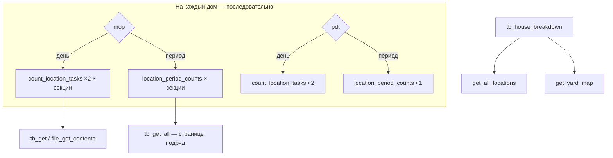
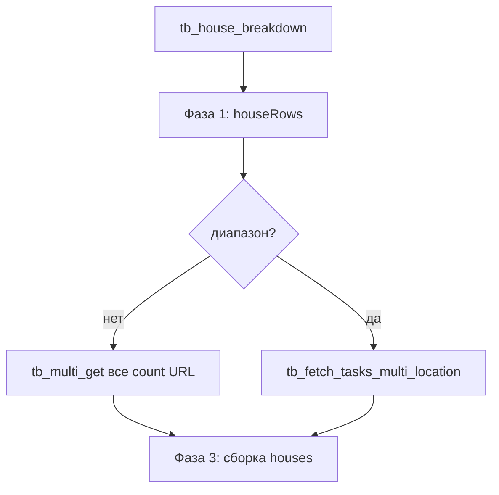

# Анализ и оптимизация `tb_house_breakdown()` — cleansyst-dashboard

Документ для разбора (Claude / ревью). Репозиторий: `api.cleansyst.ru`, проект ThroneBaron `TB_PROJECT = 2` («Новое Колпино»).

---

## 1. Проблема

При загрузке дашборда `index.html` вызывает `proxy.php?action=house_breakdown`. Расчёт **самый тяжёлый** (до ~2 минут): в цикле по домам идут множественные последовательные запросы к ThroneBaron.

Параллельно внедрён **файловый кэш** (`cache.php`, `warm_cache.php`, `bd_key`) — отдельный поток; **нутро расчёта** описано ниже.

---

## 2. HTTP-слой ThroneBaron

### 2.1. Основной транспорт (не curl)

| Функция | Механизм | Таймаут | Заголовки |
|---------|----------|---------|-----------|
| `tb_get()` | `file_get_contents()` + `stream_context_create()` | 15 с | `Authorization: Api-Key {TB_API_KEY}`, `Accept: application/json` |
| `tb_get_all()` | Цикл по `next_page_url`, до 200 страниц, 6 ретраев, `usleep(120ms)` между страницами | 25 с / стр. | те же |
| `get_all_locations()` | Пагинация `/locations` | 15 с | те же |
| `count_location_tasks()` | 1 GET, первая страница | 15 с | через `tb_auth_headers()` |

База: `https://api.thronebaron.com/v1`.

### 2.2. Параллельный транспорт (оптимизация)

| Функция | Файл | Механизм |
|---------|------|----------|
| `tb_multi_get()` | `tb_multi.php` | `curl_multi`, concurrency **≤ 10**, timeout 30 с, те же заголовки |

---

## 3. Stats-функции (исходная логика)

### 3.1. `location_period_counts($dateRange, $locId)` — база для периода

```
GET /reports/tasks?date={dateRange}&project=2&location={locId}*&limit=250
```

- `dateRange` — строка с запятой, напр. `2026-06-01,2026-06-05` (один запрос на весь диапазон, **не цикл по дням в PHP**).
- `tb_get_all()` — все страницы пагинации.
- В PHP: `done` / `missed` по `status`, остальные статусы игнорируются.

### 3.2. `mop_stats_for_house($houseLocId, $date, $allLocs, $withTasks=false)` — один день

1. Секции: `parent_id === houseLocId`.
2. **Есть секции** — для каждой `$sid`:
   - `withTasks=false` (house_breakdown): `count_location_tasks($date, $sid, 'done')` + `'missed'` → **2 GET на секцию**.
   - `withTasks=true` (house_detail): `location_tasks_bundle()` — 1 GET без фильтра status.
3. **Нет секций** — 2 GET по корню дома.
4. Возврат: `{done, missed, zones[]}`.

### 3.3. `mop_stats_for_house_period($houseLocId, $dateRange, $allLocs)` — диапазон

Та же схема секций, но `location_period_counts($dateRange, $sid)` вместо `count_location_tasks`. На секцию — **одна** цепочка `tb_get_all` (много страниц подряд).

### 3.4. `pdt_stats_for_yard($yardId, $date)` — ПДТ, день

- `yardId === null` → `{done:0, missed:0}`.
- Иначе 2× `count_location_tasks` (done + missed) по `yardId`.

### 3.5. `pdt_stats_for_yard_period($yardId, $dateRange)` — ПДТ, период

- `location_period_counts($dateRange, $yardId)` — одна пагинированная выборка.

### 3.6. `count_location_tasks($date, $locId, $status)`

```
GET /reports/tasks?date=YYYY-MM-DD&project=2&status=done|missed&location={locId}*&limit=250
```

Только **первая страница** (до 250 задач на статус). Счёт: `count($response['data'])`.

---

## 4. Наивный `tb_house_breakdown()` (до параллелизации)

Псевдокод:

```
get_all_locations() + get_yard_map()
для каждого root-дома (project=2, parent=null, не Территория, не Офис):
  если диапазон (date содержит ','):
    mop = mop_stats_for_house_period(locId, date, allLocs)   // N × tb_get_all на секции
    pdt = pdt_stats_for_yard_period(yardId, date)
  иначе:
    mop = mop_stats_for_house(locId, date, allLocs)          // 2×секции GET
    pdt = pdt_stats_for_yard(yardId, date)                   // 2 GET
  светофор: (mop.done+pdt.done) / (mop+pdt total), traffic_status
usort(houses, по pct ASC)
```

Оценка нагрузки (день, ~15 домов, ~3 секции): **~15 × (3×2 + 2) ≈ 120** последовательных GET + `get_all_locations`.

### Схема (наивная)



---

## 5. Bulk API — есть ли вариант A?

### Что используется в проекте

| Вызов | Где |
|-------|-----|
| `tb_get_all('/reports/tasks', {date, project:2})` | `tb_dashboard`, `tb_history`, warmup |
| `tb_get_all(..., {date, project, location: id*})` | `location_period_counts` |
| `GET /projects`, `GET /locations` | справочники |

Отдельного «все чек-листы проекта одним JSON» в коде **нет**.

### Проверка живого API (июнь 2026)

Пример задачи `GET /reports/tasks?date=…&project=2&limit=1`:

```json
{
  "id": "uuid",
  "project_id": 2,
  "task": { "id": 7819, "name": "Рабочая смена" },
  "status": "done",
  "start_at": "…",
  "started_at": "…",
  "attachments": […]
}
```

Поля **`location_id` / `location` в теле задачи отсутствуют** (проверено и без фильтра, и с `location=100*`). Фильтр `location={id}*` применяется **на сервере ThroneBaron**; клиент не может разложить bulk-ответ по домам в памяти.

### Вывод по стратегиям

| Стратегия | Описание | Возможна? |
|-----------|----------|-----------|
| **A** | Один запрос задач на весь проект → индекс по `location_id` | **Нет** |
| **B** | Те же URL, параллель через `tb_multi_get()`, concurrency 10 | **Да** |

---

## 6. Реализованная оптимизация (вариант B) — текущая ветка

Файлы: `proxy.php`, `tb_multi.php`, `cache.php`, `warm_cache.php`.

### 6.1. Разделение URL / compute

- `count_location_tasks_url($date, $locId, $status)` → полный URL.
- `count_location_tasks_compute($body, $http, $err)` → `count(data)` или 0 + `error_log`.
- `location_tasks_done_missed($tasks)` → подсчёт done/missed из массива (как `location_period_counts`).
- `tb_fetch_tasks_multi_location($dateRange, $locIdByKey, $concurrency=10)` — пагинация по локациям через `tb_multi_get`.

`mop_stats_for_house` / `*_period` **не удалены** — нужны для `house_detail`.

### 6.2. Три фазы `tb_house_breakdown()`

**Фаза 1** — список домов `$houseRows` (тот же порядок обхода `rootLocs`: locId, houseId, locName, yardId, sectionIds[]).

**Фаза 2 — день** (`date` без запятой):

- Собрать все URL: `mop:{sid}:done|missed`, `pdt:{yardId}:done|missed`.
- Один (батчами) `tb_multi_get($urls, tb_auth_headers(), 10, 30)`.

**Фаза 2 — период** (`date` = `start,end`):

- Уникальные `locId` (секции, корни без секций, дворы).
- `tb_fetch_tasks_multi_location($date, $locIdByKey, 10)` — параллельная пагинация (очередь `next_page_url`).

**Фаза 3** — та же арифметика (`$dc/$mc/$rate`, `mop{}`, `pdt{}`, `traffic_status`), `usort` по `pct`, формат ответа без изменений.

### 6.3. Схема (оптимизированная)



---

## 7. Кэш и прогрев (контекст, не менять при правках stats)

| Компонент | Назначение |
|-----------|------------|
| `cache.php` / `Cache` | Файлы в `cache/`, без TTL |
| `bd_key($action, $date)` | Канон ключей: `dashboard_auto`, `house_breakdown_2026-06-01_2026-06-05` |
| `proxy_serve_cached()` | Обычный запрос → кэш или `202 {warming:true}`; `?_warm=SECRET` → считает и `{ok:true}` |
| `warm_cache.php` | Cron, flock `/tmp/warm_cache.lock`, targets: dashboard+date, dashboard_auto, history&days=30, house_breakdown today/week/month |

Секрет: `WARM_SECRET = cleansyst_warm_2026`.

---

## 8. Формат ответа `house_breakdown` (жёстко сохранять)

```json
{
  "date": "2026-06-05",
  "dateFrom": "…",
  "dateTo": "…",
  "periodRange": false,
  "periodLabel": null,
  "houses": [
    {
      "id": "43к3",
      "label": "…",
      "locationId": 123,
      "done": 0, "missed": 0, "total": 0, "pct": 100, "status": "ok",
      "mop": { "done": 0, "missed": 0, "total": 0, "pct": 0 },
      "pdt": { "done": 0, "missed": 0, "total": 0, "pct": 0, "yardId": 456 }
    }
  ],
  "cached": false
}
```

Сортировка: `usort($houses, fn($a,$b) => $a['pct'] - $b['pct'])` (стабильная в PHP 8+ при равных pct).

---

## 9. Проверка эквивалентности (обязательно перед коммитом)

Скрипт: `scripts/hb_compare.php`.

```bash
# Эталон (код до рефактора) — из git или stash
php scripts/hb_compare.php --save-baseline

# Новая версия
php scripts/hb_compare.php --save-new

# Сравнение
php scripts/hb_compare.php --compare
```

Кейсы:

- **today** — `tb_house_breakdown($today)` (MSK).
- **week** — диапазон понедельник…сегодня, как `getDateParam('7')` в `index.html`.

Логировать `microtime` до/после для today и month.

Критерий: JSON **побайтово идентичен** (или идентичен по полям домов) — иначе не коммитить.

---

## 10. Риски и ограничения

1. **limit=250 на день** — `count_location_tasks` считает только первую страницу; оптимизация B сохраняет ту же семантику.
2. **Rate limit ThroneBaron** — concurrency строго **10**.
3. **Период без usleep между страницами** в `tb_fetch_tasks_multi_location` — быстрее, но возможны 429; при расхождении эталона проверить throttling.
4. **Нет PHP в CI агента** — сравнение только на сервере/локально с `php-cli` + `php-curl`.

---

## 11. Связанные файлы

| Файл | Роль |
|------|------|
| `proxy.php` | `tb_house_breakdown`, stats, `tb_get` / `tb_get_all` |
| `tb_multi.php` | `tb_multi_get` |
| `cache.php` | `Cache`, `bd_key` |
| `warm_cache.php` | Cron-прогрев |
| `index.html` | `loadHouseBreakdown()`, `fetchProxyJson`, периоды 7/30 |
| `scripts/hb_compare.php` | Эталон vs новый JSON |

---

## 12. Задача для Claude (чеклист ревью)

- [ ] Подтвердить: вариант A невозможен без `location` в task JSON.
- [ ] Проверить, что фаза 2 (день) покрывает все URL старого `mop_stats_for_house` + `pdt_stats_for_yard`.
- [ ] Проверить, что фаза 2 (период) эквивалентна `location_period_counts` (все страницы, те же статусы).
- [ ] Убедиться, что порядок домов до `usort` совпадает с legacy.
- [ ] Прогнать `hb_compare.php` на проде/стейдже с реальным API.
- [ ] Оценить выигрыш wall-time (цель: сегодня секунды вместо минут при warm cache miss).

---

*Сгенерировано из разведки и работ по ветке `cursor/proxy-file-cache-warm-dfdf`. Дата контекста: 2026-06-05.*
